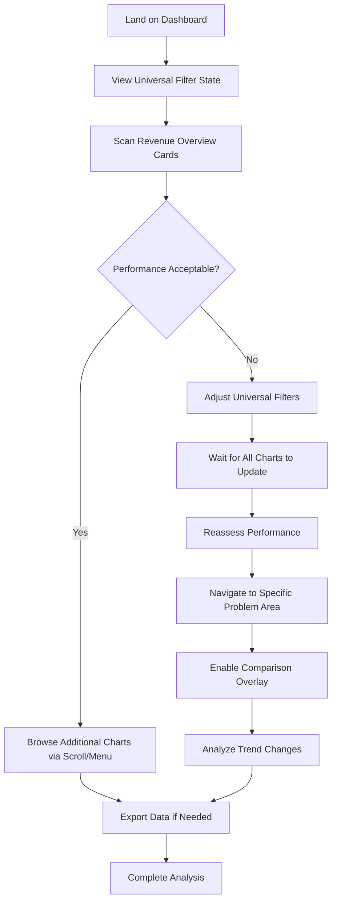
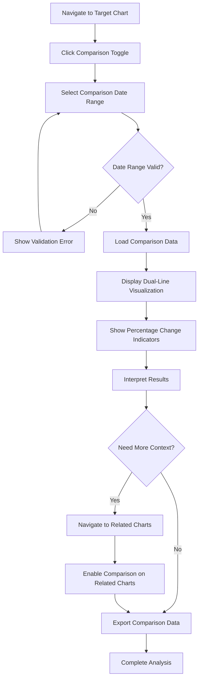
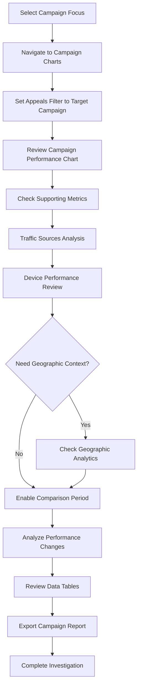

# Nonprofit Fundraising Analytics Dashboard UI/UX Specification

This document defines the user experience goals, information architecture, user flows, and visual design specifications for the Nonprofit Fundraising Analytics Dashboard. It serves as the foundation for visual design and frontend development, ensuring a cohesive and user-centered experience that exactly replicates FundraisUP's sophisticated analytics platform interface.

**Project Context:** The dashboard transforms raw phpMySQL database data into 15+ interactive chart types with universal filtering capabilities, comparison overlays, and responsive design patterns optimized for Recharts visualization components.

## Overall UX Goals & Principles

### Enhanced Target User Personas

**Development Director - "Strategic Sarah"**
- **Core Need:** Quick executive summary view + detailed drill-down capability for board reporting and strategic decisions
- **Pain Point:** Needs progressive disclosure - key metrics (£23,931.59 raised, 435 donations) prominent with details on-demand
- **Enhancement:** Information hierarchy supporting executive consumption patterns

**Fundraising Analyst - "Detail-Oriented David"**
- **Core Need:** Efficient filtering workflows + comprehensive export capabilities for stakeholder reporting
- **Pain Point:** Universal filtering requires smart defaults to prevent overwhelming complexity
- **Enhancement:** Filter presets, saved views, and contextual filtering suggestions

**Campaign Coordinator - "Action-Oriented Amy"**
- **Core Need:** Real-time campaign performance monitoring + actionable insights for operational decisions
- **Pain Point:** Static dashboard needs workflow integration for daily management tasks
- **Enhancement:** Alert thresholds, performance indicators, and trend notifications

### Refined Usability Goals

- **Progressive Loading Excellence:** Critical metrics load instantly (<1s), secondary charts load progressively
- **Smart Filter Intelligence:** Filter combinations remember user preferences and suggest relevant options
- **Accessible Data Visualization:** Charts work with screen readers and keyboard navigation (WCAG AA)
- **Mobile-Optimized Analytics:** Core insights accessible on mobile with touch-friendly interactions
- **Performance-First Design:** All interactions feel instant through optimized caching and lazy loading

### Enhanced Design Principles

1. **Inspired Visual Fidelity** - Maintain FundraisUP aesthetic while fixing accessibility and performance issues
2. **Progressive Information Architecture** - Most critical data prominent, detailed analytics discoverable
3. **Performance-Conscious Visualization** - Optimize for speed over feature completeness
4. **Accessibility-First Analytics** - Ensure charts work for all users through proper ARIA and contrast
5. **Mobile-Responsive Intelligence** - Thoughtful adaptation rather than desktop shrinking

## Information Architecture (IA)

### Site Map / Screen Inventory

```mermaid
graph TD
    A[Analytics Dashboard] --> B[Side Navigation Menu]
    A --> C[Universal Filter Bar]
    A --> D[Main Dashboard Content Area]

    B --> B1[Raised]
    B --> B2[First Installments]
    B --> B3[One-time Donations]
    B --> B4[Donations Count]
    B --> B5[Donor Retention]
    B --> B6[First Time Donors]
    B --> B7[Recurring Revenue]
    B --> B8[Donation Amount Distribution]
    B --> B9[Geographic Analytics]
    B --> B10[Traffic Sources]
    B --> B11[Campaign Performance]
    B --> B12[Device Analytics]
    B --> B13[Payment Methods]
    B --> B14[Donor Segmentation]
    B --> B15[Lifetime Value]

    C --> C1[Date Range Selector]
    C --> C2[Appeals Dropdown]
    C --> C3[Funds Dropdown]
    C --> C4[Frequency Filter]

    D --> D1[Revenue Overview Section]
    D --> D2[Core Analytics Section]
    D --> D3[Distribution Analytics Section]
    D --> D4[Attribution Analytics Section]
    D --> D5[Advanced Segmentation Section]
```



### Navigation Structure

**Primary Navigation:** Left-side persistent menu with clickable links to each chart section. Menu items correspond to specific chart anchors, enabling instant navigation to any visualization.

**Secondary Navigation:** Smooth vertical scrolling through dashboard content with section highlighting in side menu showing current viewport position.

**Dual Navigation Benefits:**
- **Quick Access:** Direct jump to specific charts via side menu clicks
- **Contextual Browsing:** Scroll through related charts to see patterns and relationships
- **Navigation State:** Active menu item highlights current chart section in viewport

**Breadcrumb Strategy:** Side menu serves as persistent navigation context. Active menu item indicates current section, with smooth scroll updating menu highlights as users browse.

**Technical Implementation:** Side menu requires scroll spy functionality to highlight active sections and smooth scroll behavior for click navigation to chart anchors.

## User Flows

### Primary Analytics Exploration Flow

**User Goal:** Quickly assess overall fundraising performance and identify areas requiring attention

**Entry Points:** Dashboard home page, direct URL access, bookmark

**Success Criteria:** User identifies key performance metrics and potential issues within 30 seconds

#### Flow Diagram



#### Edge Cases & Error Handling:
- **Slow data loading**: Show skeleton screens, allow filter changes during loading
- **No data for selected filters**: Clear "no data" messaging with filter adjustment suggestions
- **Invalid date range combinations**: Smart validation preventing impossible date selections
- **Large dataset performance**: Progressive loading with priority given to viewport charts

### Comparison Analysis Flow

**User Goal:** Compare current period performance against historical data to identify trends

**Entry Points:** Any chart section via side menu or scroll navigation

**Success Criteria:** User successfully overlays comparison data and interprets percentage changes

#### Flow Diagram



#### Edge Cases & Error Handling:
- **Overlapping date ranges**: Prevent selection with clear error messaging
- **Insufficient comparison data**: Show partial data with clear limitations noted
- **Performance with multiple comparisons**: Limit concurrent comparisons to maintain speed
- **Comparison data export**: Include both periods in exported datasets

### Campaign Performance Investigation Flow

**User Goal:** Investigate specific campaign performance using filters and detailed analytics

**Entry Points:** Side menu click to Campaign Performance, or filtered exploration from Revenue Overview

**Success Criteria:** User identifies campaign effectiveness and actionable insights

#### Flow Diagram



#### Edge Cases & Error Handling:
- **Campaign with minimal data**: Show data limitations with context
- **Filter combinations yielding no results**: Suggest alternative filter combinations
- **Complex multi-campaign analysis**: Allow multiple appeal selections in filters
- **Campaign date range issues**: Smart defaults based on campaign launch dates

## Wireframes & Mockups

### Design Files

**Primary Design Files:** FundraisUP Screenshot Reference (`screencapture-dashboard-fundraiseup-ACNSJCDJ-insights-2025-09-23-13_46_12.png`)

**Supplementary Design Requirements:**
- Responsive wireframes for tablet (768px-1024px) and mobile (320px-767px) breakpoints
- Component interaction states (hover, loading, error)
- Comparison overlay visual treatments
- Filter dropdown expanded states

### Key Screen Layouts

#### Desktop Dashboard (1200px+)

**Purpose:** Primary analytics interface matching FundraisUP's exact layout and visual treatment

**Key Elements:**
- Fixed left sidebar navigation (approximately 200px width)
- Universal filter bar spanning full content width
- Card-based chart layout with consistent spacing (16px gaps)
- Each chart card contains: header with comparison toggle, visualization area, data table
- Recharts blue gradient area charts with exact color matching
- Data tables with sortable columns and export functionality

**Interaction Notes:**
- Sidebar menu items highlight active section with smooth scroll behavior
- Universal filters trigger loading states across all visible charts
- Individual chart comparison toggles reveal date picker overlays
- Hover states on chart elements show detailed tooltips

**Design File Reference:** Main screenshot provides exact spacing, typography, and visual treatment

#### Tablet Dashboard (768px-1024px)

**Purpose:** Responsive adaptation maintaining full functionality with touch-optimized interactions

**Key Elements:**
- Collapsible sidebar menu (hamburger menu trigger)
- Stacked filter controls for better touch accessibility
- Chart cards maintain full width with adjusted proportions
- Touch-friendly comparison toggles and date pickers
- Optimized data table scrolling for touch interaction

**Interaction Notes:**
- Sidebar slides in/out with overlay backdrop
- Filter dropdowns sized for finger-friendly interaction
- Charts maintain readability with adjusted axis labeling
- Data tables support horizontal scroll with momentum

**Design File Reference:** Requires responsive wireframes based on main layout adaptation

#### Mobile Dashboard (320px-767px)

**Purpose:** Essential analytics access optimized for mobile viewing and interaction

**Key Elements:**
- Off-canvas navigation menu with section shortcuts
- Vertical filter stack with accordion-style expansion
- Single-column chart layout with priority-based ordering
- Simplified chart visualizations optimized for small screens
- Condensed data tables with horizontal scroll

**Interaction Notes:**
- Navigation accessible via hamburger menu
- Priority loading for above-the-fold charts
- Swipe gestures for chart navigation
- Comparison overlays use modal interface for clarity

**Design File Reference:** Mobile wireframes needed for responsive development guidance

## Component Library / Design System

### Design System Approach

**Simplified component library** focused on core functionality over complex abstractions. Direct Recharts integration with minimal custom wrappers, responsive design through CSS media queries rather than component variants, and progressive complexity approach starting with essential features.

### Streamlined Core Components

#### ChartContainer

**Purpose:** Lightweight wrapper for consistent chart styling and state management without over-abstraction

**Variants:** Single responsive component handling all screen sizes through CSS

**States:**
- Default (chart loaded and interactive)
- Loading (skeleton with shimmer animation)
- Error (retry functionality with clear messaging)
- No data (contextual help for filter adjustment)

**Usage Guidelines:** Minimal prop interface, direct Recharts integration, consistent 16px padding and 8px border radius. Focus on performance over feature complexity.

#### FilterControls

**Purpose:** Universal filtering system with smart cascading logic and debounced updates

**Variants:** Single responsive component adapting layout through CSS breakpoints

**States:**
- Default (all filters accessible and functional)
- Loading (filters disabled during batch updates)
- Validation error (clear error messaging with correction guidance)

**Usage Guidelines:** Debounced filter changes (300ms) to prevent excessive re-renders, smart defaults based on data availability, clear visual feedback for applied filters.

#### ChartWithTable

**Purpose:** Combined visualization and data table component reducing prop drilling complexity

**Variants:** Single component handling all chart types (Area, Line, Heatmap, Bar) through props

**States:**
- Default (chart and table synchronized with full interactivity)
- Comparison (overlay visualization with percentage change indicators)
- Loading (progressive loading - chart first, table second)

**Usage Guidelines:** Tight coupling between chart and table data ensures consistency, comparison toggle integrated directly into component, export functionality built-in.

#### SideNavigation

**Purpose:** Simple scroll spy navigation with section highlighting

**Variants:** Single component with responsive behavior through CSS

**States:**
- Default (menu visible with active section highlighting)
- Mobile (collapsible menu with hamburger trigger)
- Scrolling (smooth scroll to sections with visual feedback)

**Usage Guidelines:** Intersection Observer for scroll spy, smooth scroll behavior, minimal JavaScript for maximum performance.

**Development Benefits:**
- **Reduced Complexity:** 4 focused components vs 6 complex components with multiple variants
- **Faster Implementation:** Direct Recharts usage eliminates custom wrapper development time
- **Better Performance:** Less JavaScript abstraction, more CSS-driven responsiveness
- **Easier Maintenance:** Fewer components to test, debug, and update
- **Progressive Enhancement:** Start simple, add complexity based on user feedback

## Branding & Style Guide

### Visual Identity

**Brand Guidelines:** FundraisUP Analytics Interface Replication - Clean, professional dashboard aesthetic with emphasis on data clarity and sophisticated visualization design patterns.

### Color Palette

| Color Type | Hex Code | Usage |
|------------|----------|-------|
| Primary | #4F46E5 | Chart gradients start, primary actions, active states |
| Secondary | #06B6D4 | Chart gradients end, secondary data visualization |
| Accent | #10B981 | Positive indicators, success states, growth metrics |
| Success | #059669 | Revenue increases, positive percentage changes |
| Warning | #D97706 | Caution states, data validation warnings |
| Error | #DC2626 | Negative changes, error states, critical alerts |
| Neutral | #6B7280, #9CA3AF, #D1D5DB | Text hierarchy, borders, backgrounds |

**Chart-Specific Colors:**
- **Primary Gradient:** Linear gradient from #4F46E5 to #06B6D4 (exact FundraisUP blue)
- **Comparison Overlay:** #8B5CF6 (purple) for secondary period data
- **Grid Lines:** #F3F4F6 for subtle chart grid backgrounds
- **Data Points:** #1F2937 for precise data markers

### Typography

#### Font Families
- **Primary:** Inter, -apple-system, BlinkMacSystemFont, 'Segoe UI', sans-serif
- **Secondary:** Inter (consistent throughout interface)
- **Monospace:** 'Fira Code', 'Monaco', 'Consolas', monospace (for data tables)

#### Type Scale

| Element | Size | Weight | Line Height |
|---------|------|--------|-------------|
| H1 | 24px | 600 (Semi-bold) | 1.2 |
| H2 | 20px | 600 (Semi-bold) | 1.3 |
| H3 | 18px | 500 (Medium) | 1.4 |
| Body | 14px | 400 (Regular) | 1.5 |
| Small | 12px | 400 (Regular) | 1.4 |

**Chart-Specific Typography:**
- **Chart Titles:** 16px, 500 weight, #1F2937
- **Data Labels:** 12px, 400 weight, #6B7280
- **Tooltip Text:** 13px, 400 weight, #374151
- **Table Headers:** 12px, 500 weight, #374151
- **Data Values:** 14px, 500 weight, #1F2937

### Iconography

**Icon Library:** Heroicons v2 (outline style for consistency with modern dashboard aesthetics)

**Usage Guidelines:**
- 16px icons for inline elements and table actions
- 20px icons for navigation and major actions
- 24px icons for section headers and primary controls
- Consistent stroke-width: 1.5px for visual harmony

### Spacing & Layout

**Grid System:** 8px base unit grid system matching FundraisUP's consistent spacing patterns

**Spacing Scale:**
- **xs:** 4px (tight element spacing)
- **sm:** 8px (base unit, element padding)
- **md:** 16px (card padding, section spacing)
- **lg:** 24px (major section gaps)
- **xl:** 32px (page-level spacing)
- **2xl:** 48px (section breaks)

**Card System:**
- **Border Radius:** 8px for all cards and interactive elements
- **Shadow:** 0 1px 3px 0 rgba(0, 0, 0, 0.1), 0 1px 2px 0 rgba(0, 0, 0, 0.06)
- **Border:** 1px solid #E5E7EB for subtle definition
- **Background:** #FFFFFF (pure white for content cards)

**Layout Specifications:**
- **Sidebar Width:** 240px (desktop), collapsible on tablet/mobile
- **Content Max Width:** 1200px with auto margins for large screens
- **Chart Card Min Height:** 400px for visualization area
- **Data Table Max Height:** 300px with scroll for large datasets

**Recharts Styling Configuration:**
```css
/* Chart Container Styling */
.recharts-wrapper {
  background: #FFFFFF;
  border-radius: 8px;
}

/* Gradient Definitions */
.chart-gradient-blue {
  background: linear-gradient(180deg, #4F46E5 0%, #06B6D4 100%);
  opacity: 0.8;
}

/* Tooltip Styling */
.recharts-tooltip-wrapper {
  background: #FFFFFF;
  border: 1px solid #E5E7EB;
  border-radius: 6px;
  box-shadow: 0 4px 6px -1px rgba(0, 0, 0, 0.1);
}
```

## Accessibility Requirements

### Compliance Target

**Standard:** WCAG 2.1 AA compliance with enhanced analytics accessibility patterns, ensuring the dashboard is usable by fundraising professionals with diverse abilities while maintaining exact visual replication where accessibility permits.

### Key Requirements

**Visual:**
- Color contrast ratios: Minimum 4.5:1 for normal text, 3:1 for large text (may require slight color adjustments from FundraisUP original)
- Focus indicators: 2px solid #4F46E5 outline with 2px offset for all interactive elements
- Text sizing: Minimum 14px body text, scalable to 200% without horizontal scrolling

**Interaction:**
- Keyboard navigation: Tab order follows logical flow - filters → sidebar menu → chart interactions → data tables
- Screen reader support: Chart data accessible via data tables, ARIA labels for all visualizations, live regions for filter updates
- Touch targets: Minimum 44px touch targets for mobile filter controls and navigation elements

**Content:**
- Alternative text: Chart visualizations described in adjacent data tables, trend descriptions in ARIA labels
- Heading structure: Logical H1-H6 hierarchy with proper nesting (Dashboard H1 → Section H2 → Chart H3)
- Form labels: All filter controls properly labeled with ARIA relationships clearly defined

**Chart-Specific Accessibility:**
- **Recharts ARIA Implementation:** Custom ARIA labels describing chart type, data range, and key trends
- **Data Table Pairing:** Every chart paired with accessible data table containing identical information
- **Keyboard Chart Navigation:** Tab navigation through chart data points with screen reader announcements
- **Color-Independent Information:** Trend indicators use icons + color, percentage changes include text labels

### Testing Strategy

**Multi-Modal Testing Approach:**
1. **Screen Reader Testing:** NVDA, JAWS, and VoiceOver testing across all major chart types and interaction patterns
2. **Keyboard Navigation Testing:** Complete dashboard usage without mouse, including filter combinations and comparison overlays
3. **High Contrast Mode Testing:** Windows High Contrast and macOS Increase Contrast compatibility
4. **Mobile Accessibility Testing:** TalkBack (Android) and VoiceOver (iOS) testing for touch-based analytics interaction
5. **Color Vision Testing:** Deuteranopia and protanopia simulation to validate trend indication clarity

**Automated Testing Integration:**
- axe-core integration for continuous accessibility monitoring
- Pa11y testing in CI/CD pipeline for regression prevention
- Lighthouse accessibility auditing for performance + accessibility balance

## Responsiveness Strategy

### Breakpoints

| Breakpoint | Min Width | Max Width | Target Devices |
|------------|-----------|-----------|----------------|
| Mobile | 320px | 767px | iPhone SE to iPhone Pro Max, Android phones |
| Tablet | 768px | 1023px | iPad, Android tablets, small laptops |
| Desktop | 1024px | 1439px | Standard laptops, desktop monitors |
| Wide | 1440px | - | Large monitors, ultrawide displays |

### Adaptation Patterns

**Layout Changes:**
- **Desktop (1024px+):** Full sidebar navigation + main content area with 3-column chart grid where appropriate
- **Tablet (768px-1023px):** Collapsible sidebar menu + 2-column chart layout with touch-optimized filter controls
- **Mobile (320px-767px):** Off-canvas navigation + single-column chart stack with simplified filter interface

**Navigation Changes:**
- **Desktop:** Persistent left sidebar (240px) with scroll spy highlighting active sections
- **Tablet:** Hamburger menu triggering slide-out sidebar with backdrop overlay
- **Mobile:** Bottom-sheet style navigation menu with section shortcuts and smooth scroll

**Content Priority:**
- **Mobile First Priority:** Revenue Overview (Raised, First Installments, One-time) → Core Analytics → Distribution Analytics
- **Progressive Enhancement:** Additional charts load below-the-fold with lazy loading for performance
- **Essential vs. Advanced:** Core metrics always visible, advanced analytics (segmentation, LTV) available through "View More" expansion

**Interaction Changes:**
- **Desktop:** Hover states for chart elements, precise cursor interactions, keyboard shortcuts
- **Tablet:** Touch-optimized filter dropdowns, swipe gestures for chart navigation, larger touch targets (44px minimum)
- **Mobile:** Tap-based interactions, pull-to-refresh for data updates, modal overlays for detailed views

## Animation & Micro-interactions

### Motion Principles

**Performance-First Animation Strategy:** Subtle, purposeful animations that enhance data understanding while maintaining sub-3-second dashboard load times. Focus on CSS transforms and opacity changes for GPU acceleration, avoid JavaScript-heavy animations that could impact chart rendering performance.

**Key Principles:**
- **Data-Driven Motion:** Animations support data comprehension (chart transitions, loading states, comparison overlays)
- **Reduced Motion Respect:** All animations respect `prefers-reduced-motion` user settings
- **60fps Performance:** CSS transform-based animations maintaining smooth performance across all devices
- **Functional Feedback:** Every animation serves a UX purpose - loading, state changes, or data updates

### Key Animations

- **Chart Data Loading:** Smooth opacity fade-in from skeleton to actual chart (Duration: 300ms, Easing: ease-out)
- **Filter Application:** Subtle shake animation on invalid filter combinations (Duration: 200ms, Easing: ease-in-out)
- **Chart Comparison Overlay:** Slide-in animation for comparison period visualization (Duration: 400ms, Easing: cubic-bezier(0.4, 0, 0.2, 1))
- **Sidebar Navigation:** Smooth slide transitions for mobile menu (Duration: 250ms, Easing: ease-in-out)
- **Data Table Updates:** Gentle highlight flash for changed data cells (Duration: 500ms, Easing: ease-out)
- **Tooltip Appearance:** Quick fade-in for chart hover tooltips (Duration: 150ms, Easing: ease-out)
- **Card Hover States:** Subtle elevation change via box-shadow (Duration: 200ms, Easing: ease-out)
- **Loading Spinners:** Smooth rotation for async operations (Duration: 1000ms, Easing: linear, infinite)
- **Error State Transitions:** Color transition for validation feedback (Duration: 300ms, Easing: ease-in-out)
- **Scroll Spy Highlighting:** Smooth color transition for active nav items (Duration: 200ms, Easing: ease-out)

## Performance Considerations

### Performance Goals

- **Page Load:** Initial dashboard render under 3 seconds on 3G connection
- **Interaction Response:** Filter changes reflected across all charts within 2 seconds
- **Animation FPS:** Maintain 60fps for all transitions and micro-interactions

### Design Strategies

**Progressive Loading Architecture:**
- **Critical Path:** Load above-the-fold charts (Revenue Overview) first with skeleton placeholders for below-fold content
- **Lazy Loading:** Initialize off-screen charts only when scrolling approaches their viewport position
- **Image Optimization:** SVG icons and CSS-based graphics minimize asset loading overhead
- **Code Splitting:** Chart components loaded on-demand reducing initial JavaScript bundle size

**Data Management Performance:**
- **Debounced Filtering:** 300ms delay on filter changes to prevent excessive API calls
- **Request Batching:** Combine multiple chart data requests into optimized database queries
- **Intelligent Caching:** Cache frequently accessed filter combinations with appropriate TTL
- **Background Updates:** Non-critical chart updates happen during user idle time

**Recharts Optimization:**
- **Chart Virtualization:** Large datasets rendered with data sampling techniques
- **Memory Management:** Proper cleanup of chart instances preventing memory leaks
- **Responsive Rendering:** Chart complexity scales with viewport size and device capabilities

## Next Steps

### Immediate Actions

1. **Stakeholder Review Session** - Present complete UI/UX specification to development team and project stakeholders for approval
2. **Figma/Design Tool Setup** - Create detailed component mockups and responsive layouts in preferred design tool
3. **Accessibility Audit Planning** - Schedule initial accessibility review with compliance team before development begins
4. **Performance Baseline Establishment** - Define specific performance monitoring and measurement strategies
5. **Development Handoff Preparation** - Organize specification documentation for seamless architect and developer transition

### Design Handoff Checklist

- [x] All user flows documented with clear navigation patterns
- [x] Component inventory complete with simplified, implementation-focused architecture
- [x] Accessibility requirements defined with WCAG 2.1 AA compliance strategy
- [x] Responsive strategy clear with specific breakpoints and adaptation patterns
- [x] Brand guidelines incorporated with exact FundraisUP color extraction and Recharts styling
- [x] Performance goals established with specific load time and interaction response targets

---

## Change Log

| Date | Version | Description | Author |
|------|---------|-------------|---------|
| 2025-09-25 | 1.0 | Complete UI/UX specification for FundraisUP dashboard replication | Sally (UX Expert) |